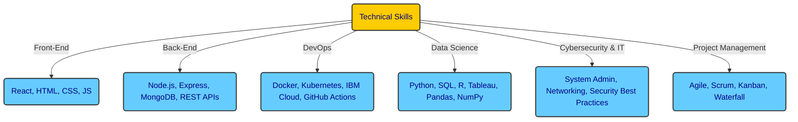

# About Me

👋 Hi, I’m <strong>Aashish Gurung</strong>

- 👀 I’m passionate about all things **Information Technology**, especially **cybersecurity**, **automation**, and **data science**.  
  My vision is to eliminate child labor through intelligent automation and build digital bridges to a more ethical and equitable future.

- 🌱 I’m currently sharpening my skills in:
  - **Cybersecurity**, having completed the **Google Cybersecurity Certificate**, and continuing hands-on labs on **TryHackMe** (e.g. *Vulnerability Management with GSA*, progressing in **SOC Level 1**, **penetration testing**, **security engineering**). Preparing for the **CompTIA Security+** exam.
  - **Cybersecurity**, having completed the **Google Cybersecurity Certificate**, and continuing hands-on labs on **TryHackMe** (e.g. *Vulnerability Management with GSA*, progressing in **SOC Level 1**, **penetration testing**, **security engineering**). Preparing for the **CompTIA Security+** exam.
  
  - **Full-stack development**, having completed the **IBM Full Stack JavaScript Developer Certificate**, where I built and deployed a containerized React/Node.js app using **Docker** and **Kubernetes** on **IBM Cloud**. Currently working on my **Skyline App** 🍂[Live Demo](https://watashiaashishgurung.github.io/skyline-app/)🍁
  
  - **Advanced Data Analytics**, with a focus on EDA, hypothesis testing, machine learning models (like Naive Bayes and decision trees), and storytelling with data.

  - **IT support fundamentals** (UCLL System & Network Administration course canceled).
  - **CompTIA A+ (In Progress)** studying core hardware, OS, networking, and troubleshooting.

- 💻 Currently working on:
  - Publishing my upcoming short story collection *"If We All Would Be the Same, That Would Be Boring"* — launching **Sometime in 2026**
  - Building **SOHO labs**: setting up small office/home office networks and practicing **subnetting**, **firewalls** and **VPN"s**
  - Volunteering: repairing **electronic devices** and **household appliances**
  - **Experimenting with VMs** (VirtualBox/VMware), using snapshots and isolated lab networks and other CS tools

- 💞️ I’m always open to collaboration on:
  - **Data analytics**, **DevSecOps**, **AI ethics**, **creative storytelling**, and **community tech education** projects

- 📫 You can find me:
  - Right here on **GitHub**
  - Doing community work on **Twitch.tv**
  - Talking tech and impact on **LinkedIn**
  - And maybe even philosophizing with you in a voice channel on **Discord**

- 😄 Pronouns: **Mr.**

- ⚡ Fun fact:  
  *"Since the beginning of mankind, we’ve been trying to catch light inside a stone — innit?"*

### 🌟 **Example Projects**

Skyline Advanced Project

Feel free to check out my <strong>Skyline project</strong>—a venture I’m particularly proud of. I’m sure you’ll like it!

👉 [SkylineAdvanced Repository](https://github.com/watashiaashishgurung/SkylineAdvanced.git)

More Projects
  

Software Development & Web Apps
  

IBM JS Fullstack Developer Course
  
    
  **• Full-Stack GiftApp (Capstone Project - IBM Full-Stack Dev)**  
  👉 [IBM Full-Stack Capstone Project Repository](https://github.com/watashiaashishgurung/IBM-fullstack-capstone-project)

  **• Shopping Cart Web App (React, Redux, Node.js, MongoDB)**  
  **• Weather Data Fetching Web App (REST APIs, React, OpenWeather API)**  
  **• Portfolio Website (Vercel Deployment, Fetch API, React, JavaScript)**  
  **• Travel Recommendation Web App (React, Firebase, API Integration)**  
  **• E-Commerce Platform MVP (React, Redux, Express, MongoDB, Docker)**  

Personal Projects
      
 
Skyline app
      

  👉[Skyline App Repository](https://github.com/watashiaashishgurung/skyline-app)
  | [Live Demo](https://watashiaashishgurung.github.io/skyline-app/)

Data Science Projects
      

Google Advanced Data Analytics
      

Waazaa

  • Waazaa

NYC TLC

  
  👉[NYC TLC Repository](https://github.com/watashiaashishgurung/NYC-TLC-automatidata)

TikTok

  • TikTok

Salifort Motors

👉[Salifort Motors](https://github.com/watashiaashishgurung/Salifort-motors-capstone-project)

Skyline app

  👉[Skyline App Repository](https://github.com/watashiaashishgurung/skyline-app)
  | [Live Demo](https://watashiaashishgurung.github.io/skyline-app/)
  

and more

  • ...

Data Analytics Projects
      

Google Data Analytics
      
  • Cyclistic

IT Support Professional
  

Google IT Support Professional
  
  • Volunteer work deNomade

  • Repair Café volunteering (electronic devices & household appliances)

Cybersecurity

Cyber security EDA

👉 [CybersecurityEDA Repository](https://github.com/watashiaashishgurung/cybercrimeEDA)

The Master Channel
  
  • Cybersecurity Fundamentals Crash Course 2023

TryHackMe
  
  • Cybersecurity Precourse 2025

  • Cyber 101 2025
  
  • Security Engineer
  
  • DevSecOps

Hobby Projects
  

Book Bansenjuku - Aftercolony 2025 161
  
  • [AWS kindle Store Bansenjuku - Aftercolony2025262](https://www.amazon.com/dp/B0DYVQ5D27?ref_=pe_93986420_775043100)

More About Me

# About Me

## 👋 Hi, I’m **Aashish Gurung!**
Passionate about **automation, data science, and full-stack development**, I thrive on **building innovative tech solutions** that make a difference. My journey spans **software development, data analytics, and IT support**, with expertise in **React, Node.js, Docker, and AI-driven analytics**. I believe in **solving real-world challenges with technology—while keeping a sense of humor!** 🚀

---

## 🌱 **Currently Learning**
- **Cybersecurity**: Completed the Google Cybersecurity Certificate; continuing practical labs (TryHackMe) and progressing toward SOC Level 1 skills.
- **CompTIA A+ Certification (In Progress)**: Core hardware, operating systems, networking, security, and troubleshooting fundamentals.
- **Advanced Data Analytics**: Exploratory data analysis, hypothesis testing, data visualization, and machine learning models like Naive Bayes & decision trees.
- **IBM Full-Stack JavaScript Developer Certificate**: Enhancing skills in **front-end & back-end development** with **React, Node.js, Express**, and exploring **modern deployment techniques** with **Docker & Kubernetes**.

---

## 🚀 **Example Projects**
### **Skyline Advanced Project**
One of my proudest ventures! This project focuses on **automation and economic empowerment** through technology.
👉 [SkylineAdvanced Repository](https://github.com/watashiaashishgurung/SkylineAdvanced.git)

### **Software Development & Web Apps**
- **Full-Stack GiftApp** (IBM Capstone Project)
- **Shopping Cart Web App** (React, Redux, Node.js, MongoDB)
- **Weather Data Fetching Web App** (REST APIs, React, OpenWeather API)
- **Portfolio Website** (Vercel Deployment, Fetch API, React, JavaScript)
- **Travel Recommendation Web App** (React, Firebase, API Integration)
- **E-Commerce Platform MVP** (React, Redux, Express, MongoDB, Docker)

### **Data Science & Analytics**
- **Cyclistic Data Cleaning & Visualization** (R, SQL, Tableau)
- **Pokémon Go Metagame Prediction Model** (Python, Machine Learning)
- **Air Quality Analysis & CO2 Dataset** (Python, Tableau, SQL)
- **Customer Churn Prediction** (Decision Trees, XGBoost)
- **EDA on Cybersecurity Incidents** (Python, Pandas, Matplotlib)

---

## 📬 **How to Reach Me**
- **GitHub:** [watashiaashishgurung](https://github.com/watashiaashishgurung)
- **LinkedIn:** [Aashish Gurung](https://www.linkedin.com/in/aashish-gurung-70140829a/)
- **Twitch:** [Your Twitch Channel](#)
- **Email:** [Your Email](#)

---

## 💻 **Technical Skills**

---

## **Certifications**
| Certification | Year |
|--------------|------|
| IBM Full-Stack JavaScript Developer Certificate | 2024-2025 |
| Google Cybersecurity Certificate | 2025 |
| Google Advanced Data Analytics Certificate | 2024 |
| Google Data Analytics Professional Certificate | 2024 |
| Google IT Support Professional Certificate | 2023 |
| Google Project Management Certificate | 2024 |
| Syntra AB Haasrode - Basic Business Management | 2010 |

---

## **Work Experience**
### **Junior JavaScript Developer** (Freelance & Projects)
✅ Developed and deployed full-stack applications using **React, Node.js, Express, and MongoDB**.  
✅ Built a **social media app** with file upload functionality & integrated **Docker** for deployment.  
✅ Designed **data-driven applications**, including a **weather forecast app** and **shopping cart web app**.  
✅ Implemented **authentication systems** using bcrypt, JWT, and session-based authentication.  
✅ Automated deployment using **Docker, Kubernetes, and IBM Cloud**.

### **Volunteer IT Support | De Nomade (2024 - Present)**
✅ Assisted newcomers with **technical troubleshooting & digital skills training**.  
✅ Installed & debugged applications like **Itsme** while providing **cybersecurity guidance**.  
✅ Proposed **structured logging** of client interactions to **optimize workflows**.

### **Business Owner & Manager | Everest Basecamp Restaurant (2010-2014)**
✅ Managed a **€100,000/month revenue** business and led a team of **10+ employees**.  
✅ Optimized operations, implemented structured workflows, and improved efficiency.

---

## 🤝 **Why Work With Me?**
✅ **Problem-Solver:** Exceptional analytical and troubleshooting skills.  
✅ **Fast Learner:** Quickly adapts to new technologies and methodologies.  
✅ **Detail-Oriented:** Focused on delivering high-quality work.  
✅ **Team Player & Independent Thinker:** Works well in teams while also thriving independently.  
✅ **Tech Enthusiast:** Passionate about continuous learning in **development, cybersecurity, and AI ethics**.

---

## 🌎 **Languages**
- **English:** Fluent  
- **Dutch:** Fluent  
- **Nepali:** Native (Speaking)  
- **French:** Basic  
- **Japanese:** Basic (Aikido)

---

## 🎯 **Hobbies & Interests**
- 🥋 **Aikido & Martial Arts** (Discipline & Strategy)  
- 📚 **Reading & Writing** (Published poetry, storytelling)  
- 🔐 **Tech & Cybersecurity Research**  
- 🎮 **Gunpla Model Building** (3D puzzle Series)  
- 🍳 **Cooking & Culinary Arts**  
- 🎥 **Community Engagement on Twitch, Discord, and YouTube**  

---

