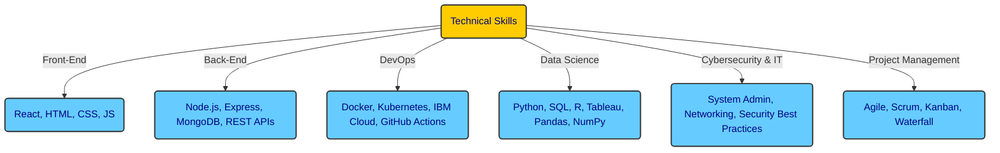

# About Me

👋 Hi, I’m <strong>Aashish Gurung</strong>

- 👀 I’m interested in ... anything information technology related, with a passion for automation that aims to eliminate child labor and create algorithms to build bridges to a better future.
- 🌱 I’m currently learning ... <strong>Advanced Data Analytics</strong>, focusing on exploratory data analysis, hypothesis testing, data visualization, and building machine learning models like Naive Bayes and decision trees.  
  I'm also pursuing the <strong>IBM Full Stack JavaScript Developer Certificate</strong>, where I’m enhancing my skills in front-end and back-end development using React, Node.js, and Express, as well as exploring modern deployment techniques using Docker and Kubernetes.
- 💞️ I’m looking to collaborate on ... topics like communication, energy management, data analytics, and data sciences, while never losing our sense of humor.
- 📫 How to reach me ... find me here on <strong>GitHub</strong>, doing community work on <strong>Twitch.tv</strong>, or via <strong>LinkedIn</strong>.
- 😄 Pronouns: ... <strong>Mr.</strong>
- ⚡ Fun fact: ... "Since the beginning of mankind, we have been trying to catch light inside a stone, innit?"

---

### 🌟 **Example Projects**

Skyline Advanced Project

Feel free to check out my <strong>Skyline project</strong>—a venture I’m particularly proud of. I’m sure you’ll like it!

👉 [SkylineAdvanced Repository](https://github.com/watashiaashishgurung/SkylineAdvanced.git)

More Projects
  

Software Development & Web Apps
  

IBM JS Fullstack Developer Course
  
    
  **• Full-Stack GiftApp (Capstone Project - IBM Full-Stack Dev)**  
  **• Shopping Cart Web App (React, Redux, Node.js, MongoDB)**  
  **• Weather Data Fetching Web App (REST APIs, React, OpenWeather API)**  
  **• Portfolio Website (Vercel Deployment, Fetch API, React, JavaScript)**  
  **• Travel Recommendation Web App (React, Firebase, API Integration)**  
  **• E-Commerce Platform MVP (React, Redux, Express, MongoDB, Docker)**  

Personal Projects
      
 
  **• SkylineAdvanced Project**

Data Science Projects
      

Google Advanced Data Analytics
      

Waazaa

  • Waazaa

NYC TLC

  • NYC TLC

TikTok

  • TikTok

Skyline Advanced

  • Skyline Advanced

and more

  • ...

Data Analytics Projects
      

Google Data Analytics
      
  • Cyclistic

IT Support Professional
  

Google IT Support Professional
  
  • Volunteer work deNomade

Cybersecurity
  

The Master Channel
  
  • Cybersecurity Fundamentals Crash Course 2023

TryHackMe
  
  • Cybersecurity Precourse 2025
  • Cyber 101 2025

Hobby Projects
  

Book Bansenjuku - Aftercolony 2025 161
  
  • [AWS kindle Store Bansenjuku - Aftercolony2025262](https://www.amazon.com/dp/B0DYVQ5D27?ref_=pe_93986420_775043100)

More About Me

# About Me

## 👋 Hi, I’m **Aashish Gurung!**
Passionate about **automation, data science, and full-stack development**, I thrive on **building innovative tech solutions** that make a difference. My journey spans **software development, data analytics, and IT support**, with expertise in **React, Node.js, Docker, and AI-driven analytics**. I believe in **solving real-world challenges with technology—while keeping a sense of humor!** 🚀

---

## 🌱 **Currently Learning**
- **Advanced Data Analytics**: Exploratory data analysis, hypothesis testing, data visualization, and machine learning models like Naive Bayes & decision trees.
- **IBM Full-Stack JavaScript Developer Certificate**: Enhancing skills in **front-end & back-end development** with **React, Node.js, Express**, and exploring **modern deployment techniques** with **Docker & Kubernetes**.

---

## 🚀 **Example Projects**
### **Skyline Advanced Project**
One of my proudest ventures! This project focuses on **automation and economic empowerment** through technology.
👉 [SkylineAdvanced Repository](https://github.com/watashiaashishgurung/SkylineAdvanced.git)

### **Software Development & Web Apps**
- **Full-Stack GiftApp** (IBM Capstone Project)
- **Shopping Cart Web App** (React, Redux, Node.js, MongoDB)
- **Weather Data Fetching Web App** (REST APIs, React, OpenWeather API)
- **Portfolio Website** (Vercel Deployment, Fetch API, React, JavaScript)
- **Travel Recommendation Web App** (React, Firebase, API Integration)
- **E-Commerce Platform MVP** (React, Redux, Express, MongoDB, Docker)

### **Data Science & Analytics**
- **Cyclistic Data Cleaning & Visualization** (R, SQL, Tableau)
- **Pokémon Go Metagame Prediction Model** (Python, Machine Learning)
- **Air Quality Analysis & CO2 Dataset** (Python, Tableau, SQL)
- **Customer Churn Prediction** (Decision Trees, XGBoost)
- **EDA on Cybersecurity Incidents** (Python, Pandas, Matplotlib)

---

## 📬 **How to Reach Me**
- **GitHub:** [watashiaashishgurung](https://github.com/watashiaashishgurung)
- **LinkedIn:** [Aashish Gurung](https://www.linkedin.com/in/aashish-gurung-70140829a/)
- **Twitch:** [Your Twitch Channel](#)
- **Email:** [Your Email](#)

---

## 💻 **Technical Skills**

---

## **Certifications**
| Certification | Year |
|--------------|------|
| IBM Full-Stack JavaScript Developer Certificate | 2024-2025 |
| Google Advanced Data Analytics Certificate | 2024 |
| Google Data Analytics Professional Certificate | 2024 |
| Google IT Support Professional Certificate | 2023 |
| Google Project Management Certificate | 2024 |
| Syntra AB Haasrode - Basic Business Management | 2010 |

---

## **Work Experience**
### **Junior JavaScript Developer** (Freelance & Projects)
✅ Developed and deployed full-stack applications using **React, Node.js, Express, and MongoDB**.  
✅ Built a **social media app** with file upload functionality & integrated **Docker** for deployment.  
✅ Designed **data-driven applications**, including a **weather forecast app** and **shopping cart web app**.  
✅ Implemented **authentication systems** using bcrypt, JWT, and session-based authentication.  
✅ Automated deployment using **Docker, Kubernetes, and IBM Cloud**.

### **Volunteer IT Support | De Nomade (2024 - Present)**
✅ Assisted newcomers with **technical troubleshooting & digital skills training**.  
✅ Installed & debugged applications like **Itsme** while providing **cybersecurity guidance**.  
✅ Proposed **structured logging** of client interactions to **optimize workflows**.

### **Business Owner & Manager | Everest Basecamp Restaurant (2010-2014)**
✅ Managed a **€100,000/month revenue** business and led a team of **10+ employees**.  
✅ Optimized operations, implemented structured workflows, and improved efficiency.

---

## 🤝 **Why Work With Me?**
✅ **Problem-Solver:** Exceptional analytical and troubleshooting skills.  
✅ **Fast Learner:** Quickly adapts to new technologies and methodologies.  
✅ **Detail-Oriented:** Focused on delivering high-quality work.  
✅ **Team Player & Independent Thinker:** Works well in teams while also thriving independently.  
✅ **Tech Enthusiast:** Passionate about continuous learning in **development, cybersecurity, and AI ethics**.

---

## 🌎 **Languages**
- **English:** Fluent  
- **Dutch:** Fluent  
- **Nepali:** Native (Speaking)  
- **French:** Basic  
- **Japanese:** Basic (Aikido)

---

## 🎯 **Hobbies & Interests**
- 🥋 **Aikido & Martial Arts** (Discipline & Strategy)  
- 📚 **Reading & Writing** (Published poetry, storytelling)  
- 🔐 **Tech & Cybersecurity Research**  
- 🎮 **Gunpla Model Building** (3D puzzle Series)  
- 🍳 **Cooking & Culinary Arts**  
- 🎥 **Community Engagement on Twitch, Discord, and YouTube**  

---

