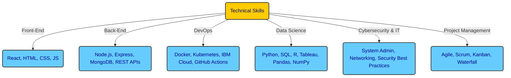

# About Me

👋 Hi, I’m <strong>Aashish Gurung</strong>

- 👀 I’m interested in ... anything information technology related, with a passion for automation that aims to eliminate child labor and create algorithms to build bridges to a better future.
- 🌱 I’m currently learning ... <strong>Advanced Data Analytics</strong>, focusing on exploratory data analysis, hypothesis testing, data visualization, and building machine learning models like Naive Bayes and decision trees.  
  I'm also pursuing the <strong>IBM Full Stack JavaScript Developer Certificate</strong>, where I’m enhancing my skills in front-end and back-end development using React, Node.js, and Express, as well as exploring modern deployment techniques using Docker and Kubernetes.
- 💞️ I’m looking to collaborate on ... topics like communication, energy management, data analytics, and data sciences, while never losing our sense of humor.
- 📫 How to reach me ... find me here on <strong>GitHub</strong>, doing community work on <strong>Twitch.tv</strong>, or via <strong>LinkedIn</strong>.
- 😄 Pronouns: ... <strong>Mr.</strong>
- ⚡ Fun fact: ... "Since the beginning of mankind, we have been trying to catch light inside a stone, innit?"

---

### 🌟 **Example Projects**

Skyline Advanced Project

Feel free to check out my <strong>Skyline project</strong>—a venture I’m particularly proud of. I’m sure you’ll like it!

👉 [SkylineAdvanced Repository](https://github.com/watashiaashishgurung/SkylineAdvanced.git)

More Projects
  

Software Development & Web Apps
  

IBM JS Fullstack Developer Course
  
    
  **• Full-Stack GiftApp (Capstone Project - IBM Full-Stack Dev)**  
  **• Shopping Cart Web App (React, Redux, Node.js, MongoDB)**  
  **• Weather Data Fetching Web App (REST APIs, React, OpenWeather API)**  
  **• Portfolio Website (Vercel Deployment, Fetch API, React, JavaScript)**  
  **• Travel Recommendation Web App (React, Firebase, API Integration)**  
  **• E-Commerce Platform MVP (React, Redux, Express, MongoDB, Docker)**  

Personal Projects
      
 
  **• SkylineAdvanced Project**

Data Science Projects
      

Google Advanced Data Analytics
      

Waazaa

  • Waazaa

NYC TLC

  • NYC TLC

TikTok

  • TikTok

Skyline Advanced

  • Skyline Advanced

and more

  • ...

Data Analytics Projects
      

Google Data Analytics
      
  • Cyclistic

IT Support Professional
  

Google IT Support Professional
  
  • Volunteer work deNomade

Cybersecurity
  

The Master Channel
  
  • Cybersecurity Fundamentals Crash Course 2023

TryHackMe
  
  • Cybersecurity Precourse 2025
  • Cyber 101 2025

Hobby Projects
  

Book Published Bansenjuku - Aftercolony 2025161
  
  • AWS kindle Store Bansenjuku - Aftercolony2025162

More About Me

#### **🚀 Watashiaashishgurung**  
💻 Junior JavaScript Developer | IT Support | Data Scientist  
📍 Location: Belgium  🇧🇪 
🌐 From: Nepal 🇳🇵

📞 Contact:  
  **• Phone:** [Your Phone Number]  
  **• Email:** [Your Email]  
  **• GitHub:** [watashiaashishgurung](https://github.com/watashiaashishgurung)  
  **• LinkedIn:** [Your LinkedIn Profile]  

**Professional Summary**  
A highly motivated <strong>Junior JavaScript Developer</strong> with a strong foundation in <strong>full-stack development, IT support, and data analytics</strong>. Recently earned the <strong>IBM Full-Stack JavaScript Developer Certificate</strong>, gaining hands-on experience in <strong>React, Node.js, Express.js, MongoDB, and Docker</strong>. Experienced in diverse industries, including hospitality, social work, and technology, showcasing adaptability, problem-solving, and strong communication skills. Passionate about <strong>automation, cybersecurity, and AI ethics</strong>, with a commitment to continuous learning and solution-oriented development.

**Technical Skills**  
  **• Front-End Development:** React, HTML, CSS, JavaScript (ES6+), Redux  
  **• Back-End Development:** Node.js, Express.js, MongoDB, REST APIs  
  **• DevOps & Cloud:** Docker, Kubernetes, IBM Cloud, GitHub Actions  
  **• Data Science & Analytics:** Python, SQL, R, Tableau, Pandas, NumPy  
  **• Cybersecurity & IT:** System Administration, Networking, IT Support, Security Best Practices  
  **• Project Management:** Agile, Scrum, Kanban, Waterfall  
  **• Basic Business Management and Bookkeeping Crash Course:** Market analysis, Financial planning, Business Management

**Certifications**  
  **• IBM Full-Stack JavaScript Developer Certificate (2024-2025)**  
  **• Google Advanced Data Analytics Professional Certificate (2024)**  
  **• Google Data Analytics Professional Certificate (2024)**  
  **• Google IT Support Professional Certificate (2023)**  
  **• Google Project Management Certificate (2024)**  
  **• Syntra AB Haasrode Getuigscrift Basis Bedrijfsbeheer (2010)** 

**Work Experience**  
**Junior JavaScript Developer (Freelance & Projects)**  
  **• Developed and deployed full-stack applications using React, Node.js, Express, and MongoDB.**  
  **• Built a social media app with file upload functionality and integrated Docker for deployment.**  
  **• Designed data-driven applications, including a weather forecast app and shopping cart web app.**  
  **• Implemented authentication systems with bcrypt, JWT, and session-based authentication.**  
  **• Automated deployment using Docker, Kubernetes, and IBM Cloud.**  

**Volunteer IT Support | De Nomade (2024 - Present)**  
  **• Assisted newcomers with technical troubleshooting and digital skills training.**  
  **• Installed and debugged applications like Itsme, providing cybersecurity best practice guidance.**  
  **• Proposed and implemented structured logging of client interactions to optimize workflows.**  

**Business Owner & Manager | Everest Basecamp Restaurant (2010-2014)**  
  **• Managed a €100,000/month revenue business and led a team of 10+ employees.**  
  **• Optimized operations, implemented structured workflows, and improved customer service and efficiency.**  

**Projects**  
**Software Development & Web Apps**  
  **• Full-Stack GiftApp (Capstone Project - IBM Full-Stack Dev)**  
  **• Shopping Cart Web App (React, Redux, Node.js, MongoDB)**  
  **• Weather Data Fetching Web App (REST APIs, React, OpenWeather API)**  
  **• Portfolio Website (Vercel Deployment, Fetch API, React, JavaScript)**  
  **• Travel Recommendation Web App (React, Firebase, API Integration)**  
  **• E-Commerce Platform MVP (React, Redux, Express, MongoDB, Docker)**  

**Data Science & Analytics**  
  **• Cyclistic Data Cleaning & Visualization (R, SQL, Tableau)**  
  **• Pokémon Go Metagame Prediction Model (Python, Machine Learning)**  
  **• Air Quality Analysis & CO2 Dataset (Python, Tableau, SQL)**  
  **• Customer Churn Prediction (Machine Learning - Decision Trees, XGBoost)**  
  **• EDA on Cybersecurity Incidents (Python, Pandas, Matplotlib)**  

**Community & Open Source**  
  **• Pokémon Bansenjuku (Fan RPG Game Project - RPG Maker XP, GitHub Kanban)**  
  **• Hosting Tech Blogs on Discord & Twitch Community Engagement**  
  **• Organizing Training & Tournaments for Football Teams (Volunteer Work)**  

**Education**  
  **• IBM Full-Stack JavaScript Developer Certificate (2024-2025)**  
  **• Google Advanced Data Analytics Professional Certificate (2024)**  
  **• Google IT Support Professional Certificate (2023)**  
  **• COV VSPW JGZ Youth & Disability Studies (2018)**  
  **• Basic Business Management & Bookkeeping (2010)**  
  **• Self-Study: Psychology, Philosophy, Cybersecurity, AI Ethics**  

**Languages**  
  **• English:** Fluent  
  **• Dutch:** Fluent  
  **• Nepali:** Native (Speaking)  
  **• French:** Basic  
  **• Japanese:** Basic (Aikido)**  

**Hobbies & Interests**  
  **• Aikido & Martial Arts** (Discipline & Strategy)  
  **• Reading & Writing** (Published poetry, storytelling)  
  **• Tech & Cybersecurity Research**  
  **• Gunpla Model Building** (3D puzzle Series)  
  **• Cooking & Culinary Arts**  
  **• Community Engagement on Twitch, Discord and YouTube**  

**Why Hire Me?**  
✅ **Problem-Solver:** Exceptional analytical and troubleshooting skills.  
✅ **Fast Learner:** Quickly adapts to new technologies and methodologies.  
✅ **Strong Work Ethic:** Disciplined and detail-oriented with a focus on delivering quality work.  
✅ **Team Player & Independent Thinker:** Able to collaborate effectively while also working autonomously.  
✅ **Passion for Tech & Growth:** Continuously learning and refining my skills in development, cybersecurity, and AI ethics.  

